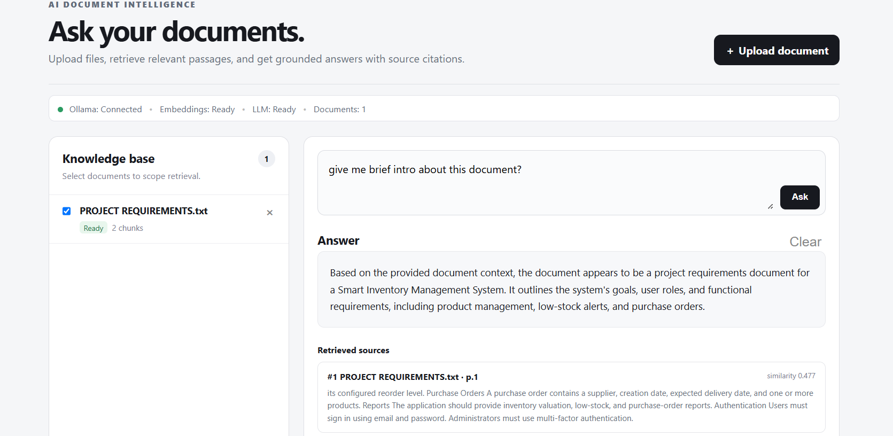

# AI-Powered Document Intelligence & RAG Platform

An end-to-end **Retrieval-Augmented Generation (RAG)** application that lets users upload documents and ask questions about them in natural language.

Instead of manually searching through a long document, users can upload a file and ask questions such as:

> "What is the company's leave policy?"

The system retrieves relevant content from the document and uses an AI model to generate a grounded answer with source references.

## Preview



## What does it do?

- 📄 Upload PDF, DOCX, and TXT documents
- 🔎 Semantic search based on the meaning of the question
- 🤖 Ask questions using natural language
- 🧠 Generate AI-powered answers using retrieved document content
- 📚 Display the document sections used to generate the answer
- 📷 Read scanned PDFs using OCR
- 🗂️ Manage multiple uploaded documents
- 🎯 Ask questions about specific documents
- 📝 Generate document overviews and summaries

## How does it work?

The application follows a Retrieval-Augmented Generation (RAG) pipeline:

**Upload Document → Extract Text → Chunk Content → Generate Embeddings → Store in Vector Database → Retrieve Relevant Chunks → Generate Grounded Answer**

For example:

**Document:** Company Handbook

**Question:**

> How many days of annual leave do employees receive?

**System:**

Retrieves the relevant section from the handbook.

**AI:**

> Employees receive 18 days of paid annual leave per year.

The application also displays the source information used to generate the answer, making the response easier to verify.

## RAG Architecture

```text
User uploads document
        ↓
PDF / DOCX / TXT extraction
        ↓
OCR for scanned PDFs
        ↓
Text chunking
        ↓
Embedding generation
        ↓
PostgreSQL + pgvector
        ↓
User asks a question
        ↓
Question embedding
        ↓
Semantic similarity search
        ↓
Relevant document chunks
        ↓
Ollama LLM
        ↓
Grounded answer
        ↓
Answer + source citations

### Project

**AI-Powered Document Intelligence & RAG Platform**

Built by **Yamini Sailaja Lakshmi**
